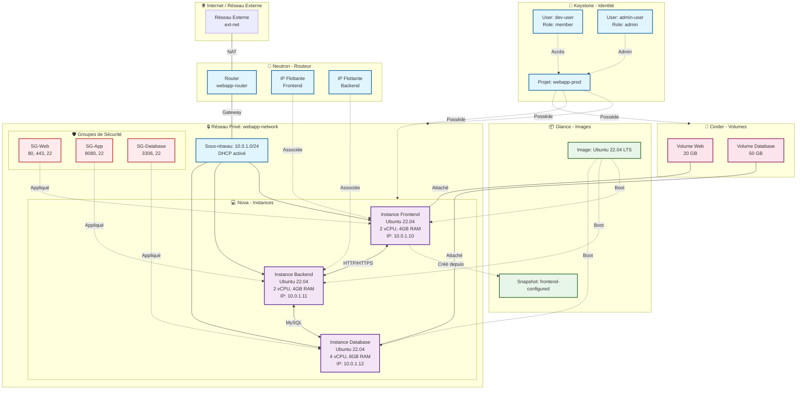

# TP Récapitulatif OpenStack
## Déploiement d'une Infrastructure Web Multi-Tiers

### 🎯 Objectif du TP

Vous êtes administrateur cloud pour l'entreprise **TechCorp**. Le département développement souhaite déployer une nouvelle application web composée de :
- Un serveur web frontend
- Un serveur d'application backend
- Un serveur de base de données

Votre mission est de créer l'infrastructure complète en utilisant les composants OpenStack que vous avez étudiés.

---

### 📋 Cahier des charges

#### Contexte de l'entreprise
TechCorp organise ses ressources cloud par projet. Le nouveau projet s'appelle **"webapp-prod"** et nécessite une équipe dédiée avec des rôles bien définis.

### Schéma de l'architecture cible

#### Architecture réseau requise
- Un réseau privé isolé pour l'application
- Un sous-réseau avec allocation DHCP
- Une connexion vers l'extérieur via un routeur
- Des règles de sécurité adaptées (ports HTTP, HTTPS, SSH, MySQL)

#### Infrastructure de calcul
- **3 instances** avec les caractéristiques suivantes :
  - Frontend : 2 vCPU, 4 GB RAM, Ubuntu 22.04
  - Backend : 2 vCPU, 4 GB RAM, Ubuntu 22.04
  - Database : 4 vCPU, 8 GB RAM, Ubuntu 22.04

#### Stockage
- Le serveur de base de données nécessite un volume additionnel de **50 GB** pour stocker les données
- Le serveur web nécessite un volume de **20 GB** pour les fichiers statiques
- Les volumes doivent survivre à la suppression des instances

#### Images système
- Utiliser une image Ubuntu 22.04 LTS
- Créer un snapshot du serveur frontend une fois configuré

---

### 🔍 Missions à accomplir

Les stagiaires doivent réaliser les étapes suivantes **dans l'ordre logique** :

#### Mission 1 : Organisation projet et identités (Keystone)
Configurer l'organisation projet et les accès :
- Créer le projet approprié
- Créer les utilisateurs nécessaires (développeur, administrateur projet)
- Attribuer les rôles adaptés
- Vérifier les permissions

#### Mission 2 : Préparation des images (Glance)
Gérer le catalogue d'images :
- Télécharger et uploader l'image Ubuntu 22.04
- Configurer les métadonnées de l'image (minimum RAM, minimum disk)
- Rendre l'image accessible au projet
- Lister et vérifier les images disponibles

#### Mission 3 : Infrastructure réseau (Neutron)
Construire l'architecture réseau complète :
- Créer le réseau privé de l'application
- Configurer le sous-réseau avec la plage IP appropriée
- Créer et configurer le routeur
- Connecter le réseau privé au réseau externe
- Créer les groupes de sécurité avec les règles nécessaires
- Allouer des IP flottantes pour l'accès externe

#### Mission 4 : Stockage bloc (Cinder)
Préparer les volumes de stockage :
- Créer les volumes pour la base de données et le frontend
- Configurer les propriétés des volumes (type, disponibilité)
- Préparer les volumes pour l'attachement

#### Mission 5 : Déploiement des instances (Nova)
Lancer l'infrastructure de calcul :
- Créer les paires de clés SSH
- Sélectionner les flavors appropriées
- Lancer les 3 instances avec les bonnes configurations
- Attacher les volumes aux instances correspondantes
- Assigner les IP flottantes
- Vérifier la connectivité

#### Mission 6 : Validation et sauvegarde (Glance & Nova)
Finaliser le déploiement :
- Créer un snapshot de l'instance frontend
- Vérifier que tous les composants sont opérationnels
- Tester la connectivité entre les instances
- Documenter l'architecture déployée

---

### 📊 Livrables attendus

À la fin du TP, vous devez être capable de fournir :

1. **La liste complète des ressources créées** avec leurs identifiants
2. **Un schéma de l'architecture réseau** déployée
3. **Les commandes OpenStack CLI** utilisées pour chaque étape
4. **Un test de connectivité** démontrant que :
   - Les instances peuvent communiquer entre elles
   - Le frontend est accessible depuis l'extérieur
   - Les volumes sont correctement attachés

---

### 💡 Conseils et bonnes pratiques

#### Méthodologie
- Planifiez l'ordre des opérations avant de commencer
- Certaines ressources dépendent d'autres : identifiez les dépendances
- Utilisez des noms explicites pour toutes vos ressources
- Documentez chaque commande que vous exécutez

#### Points d'attention
- Vérifiez les quotas du projet avant de créer des ressources
- N'oubliez pas que certaines opérations prennent du temps (création d'instance, attachement de volume)
- Les volumes doivent être dans le même availability zone que les instances
- Pensez à la sécurité : n'ouvrez que les ports nécessaires

#### Outils disponibles
Vous pouvez utiliser au choix :
- OpenStack CLI (`openstack` command)
- Horizon Dashboard (interface web)
- API REST directement

---
### ❓ Questions de réflexion

Une fois le TP terminé, réfléchissez aux questions suivantes :

1. Dans quel ordre avez-vous effectué les opérations ? Pourquoi ?
2. Quelles dépendances existe-t-il entre les différents composants OpenStack ?
3. Comment auriez-vous géré ce déploiement pour 50 instances au lieu de 3 ?
4. Quelles sont les ressources qui peuvent être partagées entre plusieurs projets ?
5. Comment sécuriser davantage cette infrastructure ?

---

### 📚 Ressources

- Documentation OpenStack : https://docs.openstack.org
- OpenStack CLI Reference : https://docs.openstack.org/python-openstackclient
- Commande d'aide : `openstack help <command>`

---

**Durée estimée** : 2-3 heures  
**Difficulté** : Intermédiaire  
**Prérequis** : Connaissances de base sur Keystone, Neutron, Nova, Glance et Cinder

## 🚀 Pour aller plus loin (bonus)

Si vous terminez avant les autres, tentez ces défis supplémentaires :

1. **Haute disponibilité** : Déployez 2 instances frontend derrière un load balancer
2. **Automatisation** : Écrivez un script Heat pour déployer l'infrastructure complète
3. **Monitoring** : Configurez des alarmes Ceilometer sur l'utilisation CPU
4. **Backup** : Créez un snapshot automatique des volumes chaque jour
5. **Sécurité avancée** : Implémentez des règles de sécurité plus strictes (microsegmentation)

---

Bon courage ! 🎓
